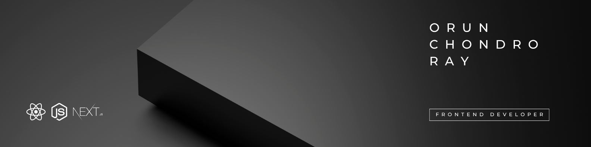

<!-- banner  -->

 

--- 

<!-- Title  -->
<h1 align="center">👋 Hi I'm Orun Chondro Ray</h1>

### 
Frontend & MERN Stack Developer | Passionate about Problem Solving | Tech Explorer

---

<!-- About Me  -->
<h2>&nbsp; About ME:</h2>

- 🔧 Favorite tech stack includes **NextJS**, **React**, **NodeJS** and **Tailwind CSS**.
- 💡 The thrill I get tackling real-world issues via **programming** keeps me **motivated**.  
- 🚀 keen on learning and adapting to **new technologies** and **trends**. 
- 🎯 I relish the opportunity to **face complex problems**.
- 📚 I consider every experience, be it a bug or a framework, as an **opportunity** to grow.
- ❤️ Love playing online PC games.

**Let’s work together to turn ideas into reality!** 🚀

---

<!-- ACurrent Activities  -->
<h2>&nbsp; Current Activities:</h2>

- 🌱 Learning advanced **NextJS**, **React**, and **NodeJS**.
- 🎨 Exploring **Figma**, **Framer**, and **UI/UX** design concepts.
- 💻 Working on a new **Railway Ticket Automation** project.
- 🤝 Looking for the **opportunity to collaborate**. 

---

<!--
**ArunRoy404/ArunRoy404** is a ✨ _special_ ✨ repository because its `README.md` (this file) appears on your GitHub profile.

Here are some ideas to get you started:

- 🔭 I’m currently working on ...
- 🌱 I’m currently learning ...
- 👯 I’m looking to collaborate on ...
- 🤔 I’m looking for help with ...
- 💬 Ask me about ...
- 📫 How to reach me: ...
- 😄 Pronouns: ...
- ⚡ Fun fact: ...
-->
